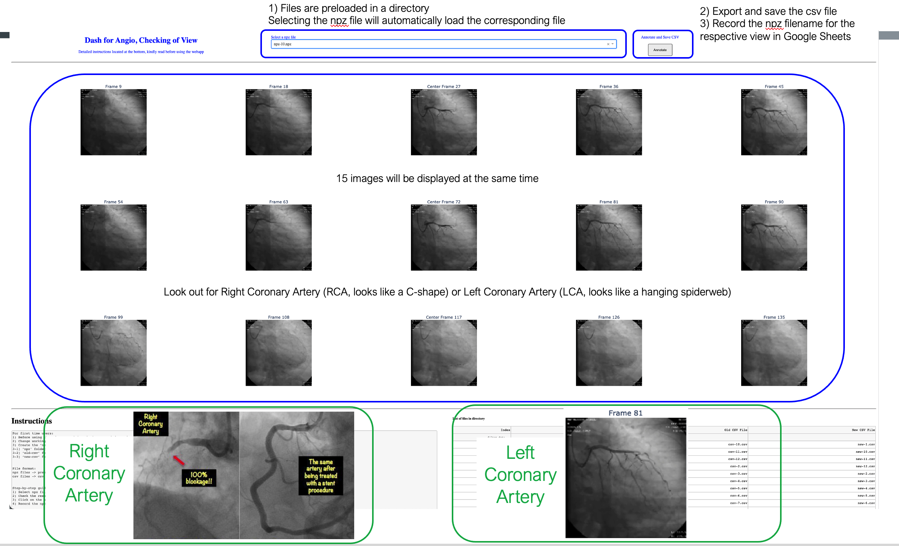

# Angio Annotation Webapp

This webapp is designed for the annotation of angiograms under the ADDA project.

### Installation and initialization

1. Clone the repo to your workstation
    
    ```
    git clone https://github.com/eddyfye/Angio-Webapp.git
    cd Angio-Webapp
    ```
    
    The python code was designed using Jupyter_dash on Jupyter notebook. It has been verified to work using either Juypter notebook or pycharm.

2. Setup a virtual environment with python (3.7 or 3.8) and install the necessary packages
    
    ```
    pip install jupyter-dash
    pip install -r requirement.txt
    ```

3. Connect to the CVPD secure storage and copy the following directory to your workstation
    
    ```
    /mnt/heart/angio/data_26-8-2020/npz for annotation/
    ```
    Under this directory, there are 3 sub-folders (npz, old-csv and new-csv)
    1) ‘npz’ folder contains the preprocessed image files in npz format (frame, channel, width, height)
    2) ‘old-csv’ folder contains the predicted annotations from the trained model in csv format
    3) ‘new-csv’ folder contains the manually corrected annotations in csv format
    
 4. Change the working directory in the webapp (main.py or check_view.py) to the view of interest found within the new copied directory
    
    Example for someone working on AP Cranial annotation
    ```
    /home/tanwp/Documents/data_26-8-2020/npz for annotation/AP Cranial/
    ```

### Step-by-step guide to using the webapp for annotation (main.py)

1) Change to the webapp directory in terminal

    Example
    ```
   cd ~/Documents/Github/Angio_Webapp
   ```

2) Run the following command to start the webapp

    ```
   python src/main.py
   ```
   
3) Select npz file from the dropdown list
4) Use the sliders to view or adjust the lower and upper boundary images and annotations on the graph
5) When the desired good frames range have been selected using the sliders, click on the annotation button located at the top right-hand corner

Note: When the npz file has multiple good frames flanked by bad frames, just move on to the next file. (do not annotate the npz file)


### Step-by-step guide to using the webapp for checking of view (check_view.py)

1) Change to the webapp directory in terminal

    Example
    ```
   cd ~/Documents/Github/Angio_Webapp
   ```

2) Run the following command to start the webapp

    ```
   python src/check_view.py
   ```

3) Select npz file from the dropdown list
4) Check the resulting 15 images for signs of Left Coronary Artery(LCA, looks like hanging spiderweb) or Right Coronary Artery(RCA, C-shaped)
5) Click on the annotation button located at the top right-hand corner
6) Record the npz filename in the respective column in Google Sheets

